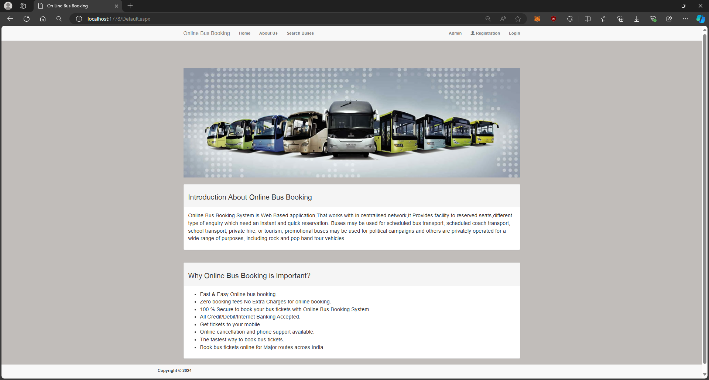
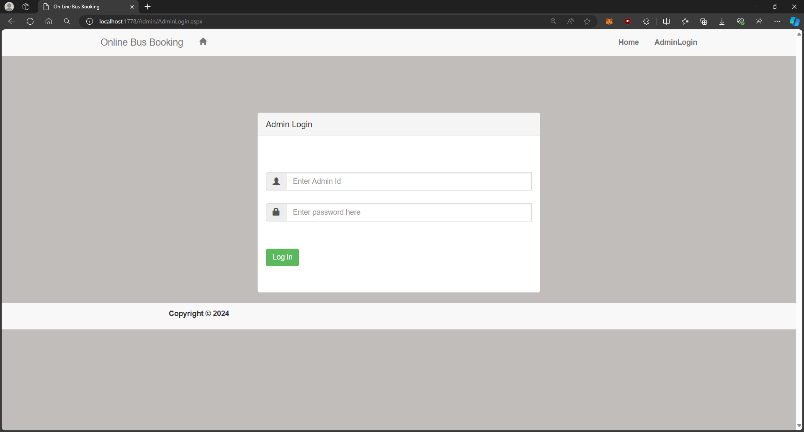
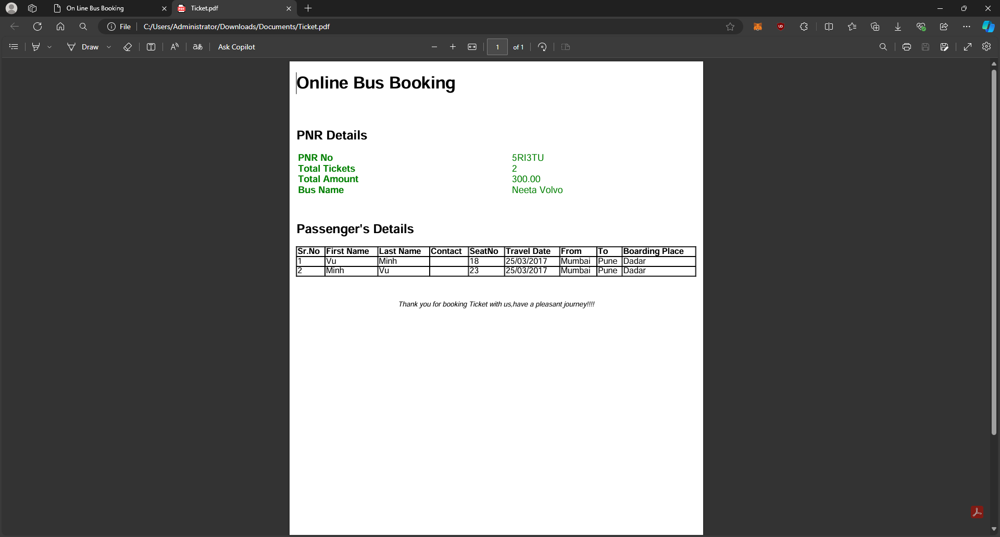

# C-ASP.Net-Online-Bus-Booking-System
Problem Statement:- 
Online Bus Booking System 

Theory:-
Online Bus Booking System is Web Based application,That works with in centralised network,It Provides facility to reserved seats,different type of enquiry which need an instant and quick reservation. Buses may be used for scheduled bus transport, scheduled coach transport, school transport, private hire, or tourism; promotional buses may be used for political campaigns and others are privately operated for a wide range of purposes, including rock and pop band tour vehicles.

This project is modularized as the following:
- Management of Route
- Trip Details
- Bus Details
- Bus Ticketing

## Demo
#### So this is our startup page:

  

#### Now by clicking on Admin button you will redirect to admin section.

  

#### After login, you will get options like add bus, Route details, Booking Report, Bus details Report.

##### Bus information

  

##### Booking Report

  

##### Add bus schedule

  

##### Add bus details

  

After registering successfully you will get a username and password then login using it.
After login you will get options like search buses, Booking Report.

##### Reservation information

  

After searching your desired bus you will get a select option and then you will proceed towards your booking.

##### Billing Information

  

After completing your payment information, you will receive a notification

##### Payment success

  

Finally, you can print out the ticket to use the service

##### Ticket

  

